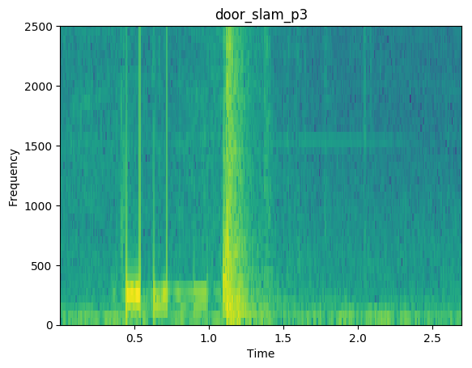
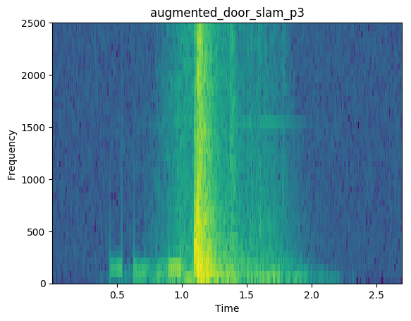

#### wellSound - chromatic approach 

###### Alice Baird 2020

_On going project for automatic emotional soundscape generation - tested in python3._   

Utilised for experiments in: 
Baird, A., Song, M., Schuller, B., Interaction with the Soundscape: Exploring An Emotional Audio Generation Approach for Improved Individual Wellbeing, HCI2020, Copenhagen, Denmark, no pagination, 10 pages, to appear (2020)

Audio used in experiments from Emo-soundscapes dataset. 
Fan, J., Thorogood, M., Pasquier, P.: Emo-soundscapes: A dataset for soundscapeemotion recognition. In: 2017 Seventh International Conference on Affective Com-puting and Intelligent Interaction (ACII). pp. 196–201. IEEE (2017)

Example output: 

1. Add any audio files to data_dir (insure no variable lengths)
		
2. For preprocessing - run 'python3 wellSounds.py chromatic pre
3. To generate notes - run 'python3 wellSounds.py chromatic gn
4. For postprocessing - run 'python3 wellSounds.py chromatic post

(optional) to cleanup directory - run 'python3 wellSounds.py chromatic cleanup

Augemented audio found in ./final_augmented_<directory>

Any questions: alicebaird@ieee.org